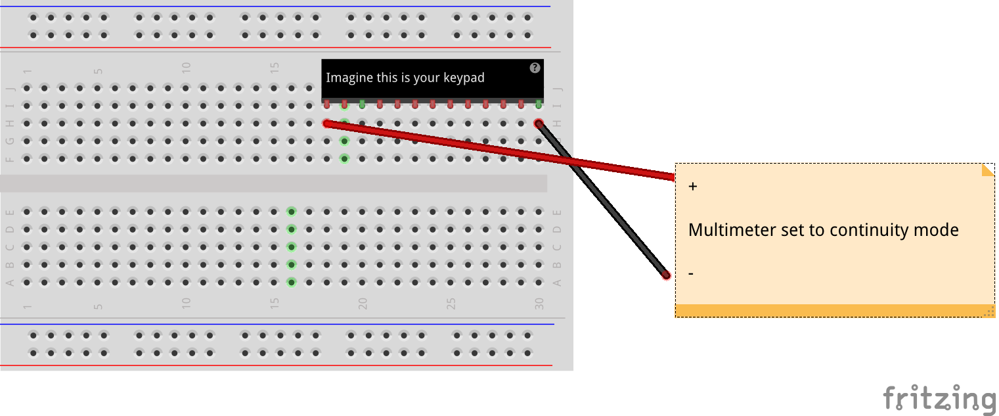

# Non-Multiplexed Keypad Driver
Have a non-multiplexed keypad that you want to use with an Arduino? Frustrated with how many pins it takes up? Then this will help you! It reads digital inputs, maps them to a set of keys, and outputs what it sees over a `SoftwareSerial` link.

## What you Need
* An Arduino (we're using a [Pro Mini](https://www.sparkfun.com/products/11113))
  * A way to program it, if it's not built into your board (we're using an [Adafruit FTDI Friend](https://www.adafruit.com/product/284)
* A non-matrix keypad
* Some way to hook up all the components, such as a [breadboard](https://adafru.it/64) or [Perma-Proto](https://adafru.it/1609)

## Steps
### Step 1: Test your keypad

Use a multimeter to see which pin connects to which button. Keep track of these.

### Step 2: Wire it up
You can wire up your circuit similarly to below, keeping track of which button goes to which pin.
